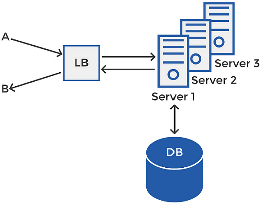
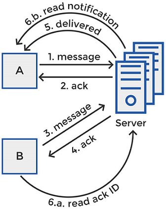
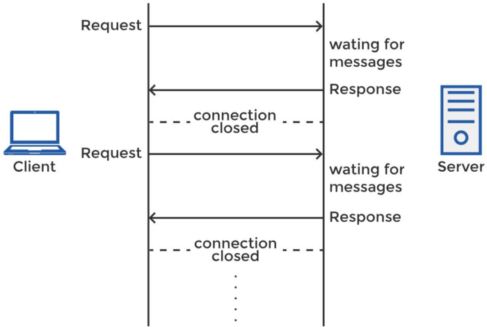
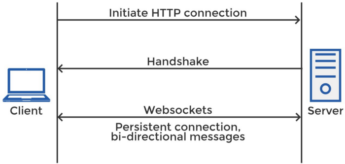
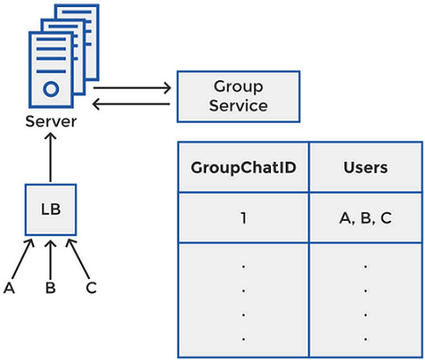

# System Design Interview: Facebook Messenger, WhatsApp, Slack, Discord or a Similar Messaging Application’s Design

---

## How To Design A Messaging App
Designing a chat service is a popular interview question asked by companies like Facebook, Amazon and Twitter. As with any system design question, designing a messaging app can be a broad topic so it’s important not to address a single approach and start discussing it from the beginning.
Take a few minutes to explore what the interviewer wants you to design. List down the key features that your messaging app should have and then generate a customized system based on the requirements.

---

## Outline The Key Features
Our messaging app should at the minimum support the following key features:
1. One-on-one-chat and group chats between users. 
2. Allow users to send text, pictures, videos and other files. 
3. Store chat history. 
4. Show the online/offline status of users. 
5. Sent/delivered/read notifications.

---

## List Down The Requirements
As of January 2021, WhatsApp supports 2 billion monthly active users according to [Statistica](https://www.statista.com/statistics/258749/most-popular-global-mobile-messenger-apps/). To build a system that can support such a large number of users, there are some additional requirements you will have to incorporate:
The service should be able to handle 2B users, with around 10B messages sent each day.
Real-time chatting with minimum latency.
The messaging service should be highly available, but consistency is of higher priority than availability in this case.
The system needs to be highly consistent. In other words, all users should see messages in the same order through any device they login from.

---

## Expected Capacity
### Estimating Message Storage
Estimating around 10B messages sent each day, with an average size of 140 bytes for each message, we’ll need around 1.4 TB of storage capacity for daily messages.

`10 billion messages * 140 bytes = 1.4 terabytes`

The above estimation assumes there’s no meta data and a single copy of messages is saved. In actual messaging applications, however, metadata along with other information are also stored. Messages are replicated across multiple caches for scalability and reduced latency.

Keeping our design simple, we’ll assume 1.4 TB of daily message storage. Now, assuming we store chat history for 10 years, we will need:

`10 years * 365 days * 1.4 TB ≅ 5 petabytes`

### Storing Online/Offline Status
Messages aren’t the only data that is stored. In the case of Facebook Messenger, for example, the users’ statuses are also stored. However, these will not need to be saved in the database, just the memory cache.

Let’s assume that Facebook Messenger also has 2 billion monthly active users. Considering the real-world scenario, they won’t all be active at the same time. Let’s assume that half of them, i.e. 1 billion are active at a time.

If each entry takes 1 KB, you’ll need:

`1 B * 1 KB = 1 terabyte` of memory space in the distributed cache.

For a scalable service such as this one 1 TB of memory cache is reasonably affordable. The messaging service sends heartbeat timestamps to the cache. A user’s online presence will be confirmed by his/her presence in the cache with a recent timestamp.

---

## Basic Architecture
For the most elementary architecture of the system, assume that there are two users, A and B who want to communicate with each other. In the ideal scenario, where A knows the address of B and B knows the address of A, they can each send information to the other at the known IP address.

---

## High Level Architecture
Coming closer to the real-world scenario, consider clients A and B are part of a bigger network, which also facilitates millions of other users for the exchange of messages. Now, in such cases, it’s not feasible that the users know the IP addresses of other users. So instead of direct connection between the users, there has to be a server in between to manage the connections.

In a horizontally scaled system, there will be multiple servers that are a part of the messaging system that A and B want to communicate through. If A wants to send a message to B, it will connect to the server that’s free and has the capacity to serve the communication. Here’s where we’ll need a **load balancer**.

In a horizontally scaled system with a cluster of several servers, client A will connect to the load balancer, and the load balancer will decide which server will serve the client at that instant. Suppose A sends the message for B through server 2. Server 2 will store the message in the database and also relay it to B through the load balancer.

At a time, server 2 may be connected to multiple clients, coordinating the sending and receiving of their messages. Now if A wants to communicate with B, it does not need to know the IP address of B. It will simply connect to a server, server 2 in this case, and the server will know the open connection portal for B (or the process that handles B’s messages). Server 2 will send the message to B via that process (more on this later in the post).

---

## Sent/Delivered/Read Notifications

The little tick marks you see below a message you sent on WhatsApp notify you whether your message has been sent, delivered and read by the receiver. Most of you would already be familiar with what each of those signs mean. But how does WhatsApp manage these notifications for you?

Let’s see how the system delivers sent, delivered and read notifications to the sender of the message.

1. A sends a message for B via a server. 
2. Because the connection will follow some messaging protocol, for example TCP, an acknowledgment will be sent to A when the server receives the message. This is the **sent** notification as shown by a single grey tick on WhatsApp. 
3. The server sends the message to the database for storage and also to the open connection for user B. 
4. When user B receives the message, it sends an acknowledgment to the server. 
5. The server sends a notification to A that the message has been delivered to B. This is the **delivered** notification as shown by a double grey tick on WhatsApp. 
6. As soon as B opens his/her phone and sees the message, an acknowledgment will need to be sent to the server. Now, this acknowledgment does not need to be sent to the same server through which the message was sent. The **read** notification may be treated as an independent message with a unique message ID. The notification will be sent over a server to A. A sees this message as a double blue tick on WhatsApp, i.e. a **read** notification.

---

## How To Handle Messages — Two Alternatives

When A establishes a connection with the server to send a message to B, the receiver B has two options for getting this message from the server:

### Pull Approach

With this approach, the receiving client, B in this case, periodically requests the server for any new messages. The server maintains a queue of messages for the client and as soon as the client makes a get request, the server will send all the pending messages in the queue for that client.

To minimize delay in receiving messages, B needs to make requests to the server at a high frequency, even if many of these requests are returned with no new messages for the client. With requests and responses at such high frequencies sent for each client, the system will ask for a lot of resources, making it infeasible for a messaging app that serves billions of users. Alternatively, let’s look at a different approach.

### Push Approach

Through the push approach, the `active clients` will maintain a connection with the server in the form of a thread or a process and will wait for the server to deliver them any new messages that appear for the client through that open connection.
Since the server immediately relays all incoming messages to the clients, the server will not need to handle any pending messages and the overheads involved in establishing a new connection will be eliminated. This approach lowers the latency to a minimum, allowing for a faster chat between clients, which is exactly what we want in your messaging system.

> Note: Since we’ve established that of the two approaches discussed above to handle messages, push approach is a more fitting option since it involves minimum resources and minimum latency, that’s the one we’ll move forward with. In the next section, we’ll see how the server and client exchange information using the push approach.

---

## Server-Client Connection

Moving forward with the push approach for the communication between the server and the client, we again have two choices: Long Polling and WebSockets.

### Long Polling

When a client requests the server for information, the server holds the connection open until there are new messages for the client or the connection times out. When the server responds with the new messages, the connection ends. Once the connection ends, the client immediately initiates another request to the server for messages and the cycle repeats. This approach lowers the latencies and resources involved in the pull approach (polling).

### WebSockets

Alternatively, the server can send alerts to the clients via WebSocket connections. An HTTP connection set up by a client with a server can be established into a WebSocket connection via a ‘handshake’. This is a bidirectional and consistent connection between the server and client and can be used for both sending and receiving messages.

---

## Where To Send Messages?

When using the push method, the server maintains an open connection with several active users at the same time. How will it pick which process to send an incoming message to? It will need a hash table to map the clients onto the process or thread that’s open for them. This hash table will map the user ID as ‘key’ onto the connection ID. Once the server scans the table to locate the connection ID for the intended User ID for an incoming message, it sends the message through that open connection.

### What If The Intended User Is Offline?

If a message is received for a user, let’s say B, that has gone offline and is not connected with the server anymore, our messaging system will not find an entry for B in the hash table discussed above. This is because B does not have an open connection with the server, so there is no connection ID either. So where will the server save the message that came for B?

This message will be saved in the database against B’s User ID. As soon user B connects to the server and an open connection is generated for B, the database is checked for any new messages against B’s User ID. The message that was waiting in the database for B is relayed through the open connection for B and B receives the message.

### Online/Offline Status Or Last Seen

Facebook messenger shows online/offline status of users. WhatsApp shows ‘Last Seen’. Though slightly different, both these features can be implemented using the same basics. As discussed earlier in the post, the information for the user’s status is saved in the memory cache rather than the database.

So, to know if the user is online or offline or when the user was ‘Last Seen’, we need a heartbeat that the online users periodically send to the server. The server continues updating the heartbeat timestamp in a table stored in the memory cache. All the active users will have an entry in this table with a timestamp value against their user ID.

Suppose the system is configured such that the online clients send a heartbeat every 5 seconds. So a client, let’s say, A, sends a heartbeat every 5 seconds, letting the server know that A is using the application. As the messaging server receives the heartbeat, it updates the time in the table.

A will be online if he/she has an entry in the table and the timestamp is recent. If another user, say B, wants to know A’s status, the server can read A’s timestamp in the table to check if he/she is online or offline and display it to B. Similarly, in case of WhatsApp, if B wants to know when A was last available, the server will read the timestamp against A’s user ID in the table and display it to B.

---

## Group Chat

We can extend our design for the messaging system to accommodate group chats. A message sent to a group chat by one of the members in the chat needs to be received by all the members of the chat.

Each group chat is considered as a unique object and is assigned a GroupChatID. Suppose A sends a message in a group with 1 as the GroupChatID. The load balancer will look up the server that handles group 1 and sends the message to that server. The server has a service that handles group messages and it queries this service for the other users that are also a part of the group chat. The group service maintains a table that stores all the members of each GroupChatID as you can see in the picture.

The group service returns all the users, A, B and C, that are part of the group chat 1. The server then sends the message to the different connections handling the messages for A, B and C (they can be handled by the same server or different). Through the unique open connections for A, B and C, the group message is delivered to each of the members of the chat.

---

### Top 5 YouTube Videos On Designing A Messenger Service
1. [Whatsapp System design or software architecture by Tech Dummies Narendra L](https://www.youtube.com/watch?v=L7LtmfFYjc4) 
2. [System Design: Messenger service like Whatsapp or WeChat — Interview Question by Success in Tech](https://www.youtube.com/watch?v=5m0L0k8ZtEs) 
3. [Whatsapp System Design: Chat Messaging Systems for Interviews by Gaurav Sen ](https://www.youtube.com/watch?v=vvhC64hQZMk)
4. [System Design : Design messaging/chat service like Facebook Messenger or Whatsapp by Tushar Roy — Coding Made Simple](https://www.youtube.com/watch?v=zKPNUMkwOJE) 
5. [System Design Mock Interview: Design Facebook Messenger by Exponent](https://www.youtube.com/watch?v=uzeJb7ZjoQ4&t=14s)

---

## Conclusion
This was the basic architecture for a messaging system that can support both one-on-one chat and group chats. We also discussed some useful extras that are almost always a part of the popular messaging apps, including user status and delivery notifications.

If you have some extra time during the interview, you can also extend the design to discuss some additional useful points such as the support for media files. Since media files are far greater in size than text, you may want to incorporate compression techniques or cloud storage in the design.

You can also talk about message encryption where the members of a particular chat use an encryption key to decode the messages.

---

###### credit/reference/taken-from
[System Design Interview: Facebook Messenger, WhatsApp, Slack, Discord or a Similar Messaging Application’s Design](https://medium.com/double-pointer/system-design-interview-facebook-messenger-whatsapp-slack-discord-or-a-similar-applications-47ecbf2f723d)